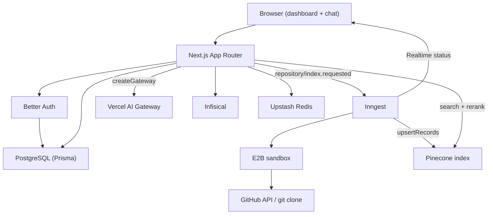
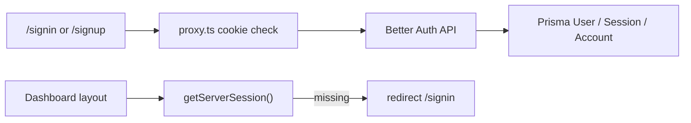
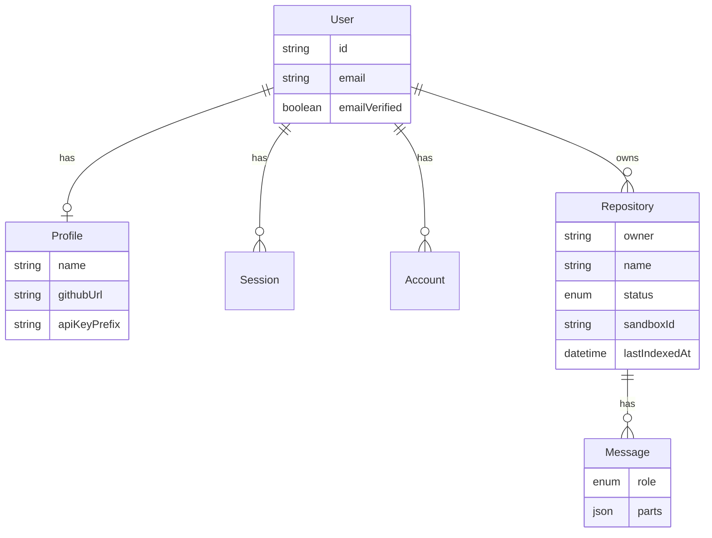
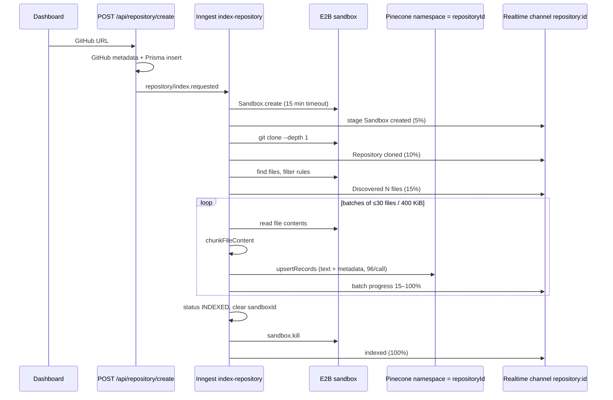
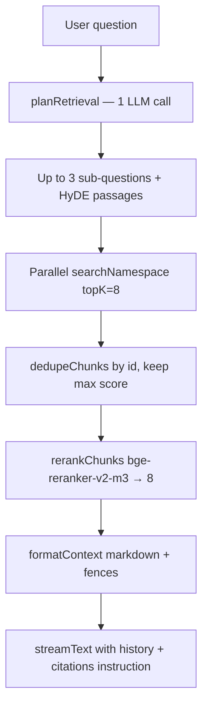
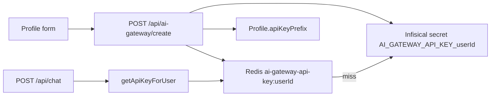

# RepoAsk

RepoAsk is a Next.js app for asking questions about public GitHub repositories. You paste a repo URL, the app clones it in an isolated [E2B](https://e2b.dev) sandbox, chunks the source, and upserts records into a [Pinecone](https://www.pinecone.io) integrated index. Chat answers are grounded in retrieved code via query decomposition, HyDE, vector search, and reranking.

The product name in the UI is **RepoAsk**. Stack: Next.js 16, React 19, Prisma 7 (PostgreSQL), Better Auth, Inngest (durable jobs + realtime), Pinecone, Vercel AI SDK / AI Gateway, E2B, Upstash Redis, and Infisical.

---

## What it does

1. Sign up with email and password.
2. Save a personal [Vercel AI Gateway](https://vercel.com/docs/ai-gateway) API key (stored in Infisical, cached in Redis; only an 8-character prefix is kept in Postgres).
3. Add a **public** GitHub repository. RepoAsk fetches metadata from the GitHub API and starts an Inngest indexing job.
4. Watch indexing progress live on the dashboard (Inngest Realtime).
5. Open a per-repository chat. Answers cite file paths and line ranges from retrieved chunks.

Private GitHub repositories are rejected (`400`). Chat is blocked until the repository status is `INDEXED` (`409`).

---

## Tech stack

| Layer | Choice |
| --- | --- |
| App | Next.js 16 (App Router), React 19, Tailwind 4, shadcn/ui |
| Auth | Better Auth (`emailAndPassword`) + Prisma adapter |
| Database | PostgreSQL via Prisma 7 + `@prisma/adapter-pg` |
| Jobs | Inngest SDK v4 (`index-repository`, `health-check`) |
| Isolation | E2B sandboxes for `git clone` and file reads |
| Vectors | Pinecone integrated records API (server-side embeddings) |
| Rerank | Pinecone Inference `bge-reranker-v2-m3` |
| LLM | Vercel AI Gateway, model `inclusionai/ling-3.0-flash-fin-free` |
| Secrets | Infisical (AI Gateway keys) + Upstash Redis cache |
| Avatars | ImageKit signed uploads |
| Client data | TanStack Query, `nuqs` |

---

## High-level architecture



Request paths of interest:

- Pages: `/signin`, `/signup`, `/dashboard`, `/chat/[id]`, `/profile`
- Auth catch-all: `/api/auth/[...all]`
- Inngest serve: `/api/inngest` (`GET` / `POST` / `PUT`)
- Chat: `POST /api/chat` (AI SDK UI message stream)

Route protection uses Next.js 16 `proxy.ts` (cookie presence only). Layouts and API routes still call `auth.api.getSession()`.

---

## Repository layout

```text
app/
  (auth)/signin, signup     Better Auth forms
  (dashboard)/              Sidebar shell; requires session
    dashboard/              Repo list, add repo, live indexing
    chat/[id]/              Per-repo chat (only if INDEXED)
    profile/                Profile + AI Gateway key
  api/
    auth/[...all]/          Better Auth handler
    inngest/                Serve Inngest functions
    repository/             Create, list, delete
    chat/                   RAG chat + clear history
    profile/                CRUD
    ai-gateway/             Create/delete Infisical secret
    upload-auth/            ImageKit upload params
functions/
  index-repository.ts       Durable clone → chunk → upsert
  health-check.ts           Smoke test function
lib/
  auth.ts, auth-client.ts   Better Auth server + React client
  inngest.ts                Inngest client id: "repo-ask"
  inngest-channels.ts       Realtime channel schema
  pinecone.ts, prisma.ts, redis.ts, secret.ts
  repository-indexing/      File rules, chunking, batching
  retrieval/                Plan, search, rerank, format
  ai-gateway-key-cache.ts   Redis + Infisical lookup
server/
  repository-realtime.ts    Subscription tokens (authz)
prisma/schema.prisma
proxy.ts                    Optimistic cookie redirects
```

---

## Authentication

Better Auth is configured in `lib/auth.ts` with the Prisma adapter (PostgreSQL).

| Setting | Value |
| --- | --- |
| Method | Email + password only |
| Password length | 8–128 |
| Account deletion | Enabled |
| Session cookie cache | 5 minutes |
| Rate limits | `/sign-in/email` and `/sign-up/email`: 5 / 60s |
| Extra validation | Zod `signUpSchema` / `signInSchema` in a `before` hook |
| Plugin | `nextCookies()` |

Client: `lib/auth-client.ts` (`createAuthClient()`). Server session: `getServerSession()` in `lib/auth-session.ts` (`cache()` + `auth.api.getSession`).



`proxy.ts` only reads the session cookie. It redirects unauthenticated users away from app pages and authenticated users away from `/signin` and `/signup`. It does **not** match `/api/*`. Every API route that mutates data must still verify the session.

---

## Data model



`RepositoryStatus`: `INDEXING` | `INDEXED` | `FAILED`.  
`MessageRole`: `USER` | `ASSISTANT`.

Uniqueness: `(userId, owner, name)` on `Repository`. Messages store AI SDK UI `parts` as JSON. Deleting a repository cascades messages and best-effort deletes the Pinecone namespace (`app/api/repository/delete/[id]/route.ts`).

The AI Gateway secret itself is **not** in Postgres. Infisical stores `AI_GATEWAY_API_KEY_{userId}`; Redis caches it; `Profile.apiKeyPrefix` is the first 8 characters for the UI.

---

## Indexing pipeline

Triggered when a user adds a repo (`POST /api/repository/create`):

1. Parse `https://github.com/{owner}/{repo}`.
2. `GET https://api.github.com/repos/{owner}/{repo}` (public only).
3. Insert `Repository` with `status: INDEXING`.
4. `inngest.send({ name: "repository/index.requested", data: { repositoryId, userId, githubUrl } })`.

The durable function is `functions/index-repository.ts` (`id: "index-repository"`, **1 retry**). On failure it marks the row `FAILED`, kills any leftover sandbox, and publishes a failed realtime event.



### E2B sandbox

| Detail | Value |
| --- | --- |
| SDK | `e2b` (`Sandbox.create` / `connect` / `kill`) |
| Timeout | 15 minutes (`SANDBOX_TIMEOUT_MS`) |
| Clone path | `/home/user/repository` |
| Clone | `git clone --depth 1` (2 minute command timeout) |
| Discovery | `find … -type f -printf '%s\t%p\n'` |
| Persistence | `Repository.sandboxId` until success or failure cleanup |

The sandbox exists only for indexing. After a successful run it is destroyed and `sandboxId` is set to `null`. Failure handlers also attempt `destroySandbox`. Chat does **not** execute code in E2B.

### File selection

From `lib/repository-indexing/file-rules.ts`:

- Skip directories: `.git`, `node_modules`, `dist`, `build`, `.next`, `.nuxt`, `coverage`, `vendor`, `target`, `.cache`, `tmp`
- Max file size: **1 MiB**
- Max files: **1000**
- Batches: **30 files** or **400 KiB**, whichever comes first
- Extensions: TS/JS, Python, Java, Go, Rust, C/C++, C#, PHP, Ruby, Swift, Kotlin, HTML/CSS, JSON/YAML/TOML, Markdown/MDX

Unknown extensions are skipped.

### Chunking

`lib/repository-indexing/chunking.ts` — target **~4000 characters** (~1000 tokens), overlap **~600 characters** (~150 tokens) for source.

| `fileType` | Strategy |
| --- | --- |
| `SOURCE` | Line windows; prefer blank lines or declaration keywords as break points |
| `DOCUMENTATION` | Split on Markdown headings, then paragraphs if a section is oversized |
| `CONFIGURATION` | Whole file if ≤ 1.5× target; otherwise line chunks with **no** overlap |

Chunk IDs: SHA-256 of `{repositoryId}:{filePath}:{chunkIndex}`.

### Pinecone write path

Each repository is a **namespace** named with the repository UUID. Records use the integrated records API: the `text` field is embedded **on Pinecone** (no local embedding call). Metadata stored with each record: `repositoryId`, `filePath`, `language`, `fileType`, `startLine`, `endLine`, `chunkIndex`. Upserts are batched at **96** records.

The index name comes from env `PINEC0NE_INDEX_NAME` (the identifier uses a zero, matching the code). The index must be created as an **integrated embedding** index so `upsertRecords` / `searchRecords` with `{ inputs: { text } }` work.

---

## Retrieval and chat pipeline

`POST /api/chat` (`maxDuration = 60`):

1. Require session; load repository owned by the user; require `INDEXED`.
2. Resolve the AI Gateway key (`getApiKeyForUser`: Redis, then Infisical).
3. Upsert the new user message; delete later messages (edit / regenerate semantics).
4. Load full history; `validateUIMessages`.
5. Run `retrieveContext` on the latest user text.
6. `streamText` with a system prompt that includes formatted chunks.
7. Persist the assistant message when the stream completes.



### Query planning and HyDE

`lib/retrieval/pipeline.ts` uses a **single** `generateText` call (free-tier gateway rate limits) to emit blocks:

```text
Q: <sub-question>
A: <hypothetical source/docs passage>
```

At most **3** sub-queries. Each HyDE passage is what gets embedded for search (answers sit closer in vector space to real code than raw questions). On parse or LLM failure, the original query is used as both Q and A.

### Vector search and rerank

`lib/retrieval/search.ts`:

- `index.searchRecords({ query: { topK, inputs: { text } } })` per HyDE string (`MATCHES_PER_SUBQUERY = 8`)
- Deduplicate by chunk id
- `pinecone.inference.rerank` with **`bge-reranker-v2-m3`**, `topN = 8`, `rankFields: ["text"]`, `truncate: "END"` (model cap 1024 tokens per query+document pair)
- If rerank fails, fall back to vector score order, still capped at 8

Chat model for both planning and answering: **`inclusionai/ling-3.0-flash-fin-free`** through `createGateway({ apiKey }).chat(...)`.

The assistant is instructed to answer **only** from retrieved context and to cite paths (and line numbers when useful).

---

## Inngest

Client: `new Inngest({ id: "repo-ask" })` in `lib/inngest.ts`.

Served from `app/api/inngest/route.ts`:

| Function id | Trigger | Role |
| --- | --- | --- |
| `index-repository` | `repository/index.requested` | Clone, chunk, upsert, status |
| `health-check` | `app/health.check` | Connectivity smoke test |

Realtime channel (`lib/inngest-channels.ts`):

```text
channel: repository:{repositoryId}
topic: status
payload: { repositoryId, stage, status, message?, progress? }
```

The dashboard subscribes with `useRealtime` (`components/dashboard/repository-realtime-sync.tsx`). Tokens are minted in `getRepositoryStatusToken` after confirming the repository belongs to the current user.

Local development: run the Inngest Dev Server against `http://localhost:3000/api/inngest` (typical: `npx inngest-cli@latest dev`). Production needs Inngest signing/event keys and a synced app.

---

## AI models and keys

| Job | Model / mechanism | Where |
| --- | --- | --- |
| Chat + retrieval plan | `inclusionai/ling-3.0-flash-fin-free` | Vercel AI Gateway, per-user key |
| Embeddings | Hosted on the Pinecone integrated index | `upsertRecords` / `searchRecords` `text` field |
| Rerank | `bge-reranker-v2-m3` | Pinecone Inference API |

Users paste their own AI Gateway key in Profile. Flow:



Infisical auth uses universal auth (`CLIENT_ID`, `CLIENT_SECRET`) against project `PROJECT_ID`, environment `"dev"`.

---

## HTTP API (authenticated unless noted)

| Method | Path | Purpose |
| --- | --- | --- |
| `*` | `/api/auth/[...all]` | Better Auth |
| `GET/POST/PUT` | `/api/inngest` | Inngest serve (signed by Inngest) |
| `POST` | `/api/repository/create` | Add public repo + enqueue index |
| `GET` | `/api/repository/get` | List current user's repos |
| `DELETE` | `/api/repository/delete/[id]` | Delete row + Pinecone namespace |
| `POST` | `/api/chat` | RAG stream (`id` = repository id) |
| `DELETE` | `/api/chat/clear/[id]` | Delete messages for that repo |
| `POST/GET/PATCH/DELETE` | `/api/profile/*` | Profile CRUD |
| `POST/DELETE` | `/api/ai-gateway/create`, `delete` | Store / remove gateway key |
| `GET` | `/api/upload-auth` | ImageKit upload token |

---

## Environment variables

There is no committed `.env.example`. Values read in source:

| Variable | Used for |
| --- | --- |
| `DATABASE_URL` | Prisma PostgreSQL |
| `PINECONE_API_KEY` | Pinecone client |
| `PINEC0NE_INDEX_NAME` | Index name (note `0`, not `O`) |
| `CLIENT_ID` / `CLIENT_SECRET` / `PROJECT_ID` | Infisical universal auth |
| `IMAGEKIT_PUBLIC_KEY` / `IMAGEKIT_PRIVATE_KEY` | Avatar uploads |
| Upstash `Redis.fromEnv()` | typically `UPSTASH_REDIS_REST_URL` and `UPSTASH_REDIS_REST_TOKEN` |

Also required by the SDKs (not always referenced by name in app code):

| Variable | Used for |
| --- | --- |
| `BETTER_AUTH_SECRET` / `BETTER_AUTH_URL` | Better Auth |
| `E2B_API_KEY` | E2B sandboxes |
| `INNGEST_EVENT_KEY` / `INNGEST_SIGNING_KEY` | Inngest (cloud) |

Create a Pinecone **integrated embedding** index whose name matches `PINEC0NE_INDEX_NAME`.

---

## Local development

```bash
npm install
# configure env, then apply Prisma migrations
npx prisma migrate dev
npm run dev
```

In a second terminal, start Inngest and point it at the Next app:

```bash
npx inngest-cli@latest dev -u http://localhost:3000/api/inngest
```

Scripts:

| Script | Command |
| --- | --- |
| `dev` | `next dev` |
| `build` / `start` | production |
| `lint` | ESLint |
| `typecheck` | `tsc --noEmit` |
| `format` | Prettier on `ts`/`tsx` |
| `postinstall` | `prisma generate` |

You also need: PostgreSQL, a Pinecone index, an E2B account, Infisical (or equivalent secrets for gateway keys), Upstash Redis, ImageKit if using profile photos, and a Vercel AI Gateway key per user.

---

## Product constraints

- Public GitHub repositories only; no GitHub OAuth or private clone tokens.
- Indexing caps: 1000 files, 1 MiB per file, shallow clone of default remote HEAD.
- Chat requires an indexed repo and a stored AI Gateway key.
- Retrieval uses at most 8 context chunks after rerank.
- Indexing sandboxes are ephemeral; they are not reused for chat or code execution.
- `proxy.ts` is optimistic; server routes remain the source of truth for authorization.

---

## License

Private package (`"private": true` in `package.json`).
